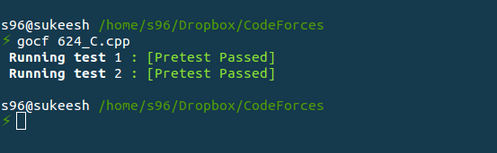

# GoCF
Contest parser for codeforces ( only C++ )

**While Parsing Contest initially**

**While testing your solution**

**How to install it?**  
* copy `gocf` and `incf` file to `/bin/` directory  
* give permissions to them by `sudo chmod 755 /bin/gocf` and `sudo chmod 755 /bin/incf`  
* Now create a directory in your `home` folder and name it `GoCF`  
* copy `Parse.py` from `GoCF_files` to `GoCF` and if neccessary do `chmod`  

**How to use it?**  
* After the contest begins, fire up your terminal and type `incf`  
* Now, enter the contest code  
* GoCF will now download the test cases for you!  
* Now, for example let us take contest code as `624` and name your problems as `624_A.cpp`, `624_B.cpp`, ... ( Case sensitive ) 
* Code in your favourite editor ( subl / vim / .. ) or even ide ! 
* Compile  
* now, for testing your solution just `gocf 624_A.cpp`  

**That's it!** 

Note : Pull requests are accepted  

Star it  

report bugs at : vsukeeshbabu[at]gmail[dot]com

